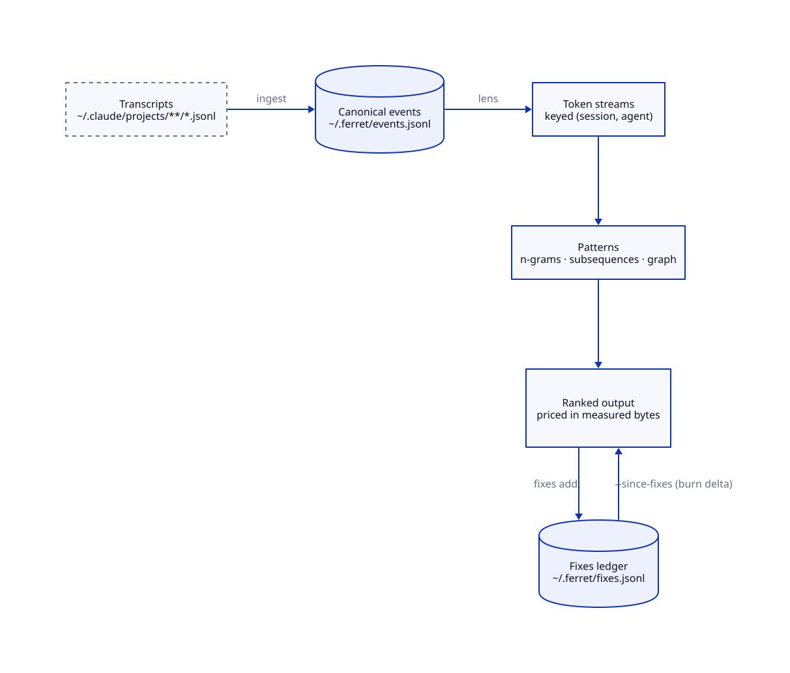

# ferret

> ★ ferrets out tool-use friction and pathological interaction patterns in Claude Code logs so we can intentionally learn and improve

`ferret` **turns a pile of session logs into a ranked repair list** for **anyone tuning an agent's tools, hooks, and memory**, without **guessing which habit costs the most** — every finding is priced in bytes that actually entered a request body, over the whole corpus, with no model in the loop.

AX-first: the primary reader is Claude itself.

## See it work

```console
$ ferret ingest
health unpaired=0.0% shell-fallback=14 deduped=663 decode-errs=0
api-ledger calls=105546 duplicate-lines-collapsed=95813

$ ferret status
ferret /Users/you/.ferret · 553506 events · 2872 sessions · built 2026-08-24T14:36:19-04:00
waste≤22.4MB of 477.1MB context bytes — top 3:
       1.3MB  misfire    191x  Read
       1.1MB  misfire    543x  SendMessage
    1017.0KB  misfire    709x  Edit
next:
  ferret friction

$ ferret friction --limit 4
friction rows=6983 waste≤28.2MB [poll 12.6MB · misfire 9.7MB · motif 5.8MB]  gross=477.1MB
     1.5MB waste    246x   261 sess          0B gross  motif    Read ⇝ Read ⇝ Edit
     1.3MB waste    191x   124 sess      76.9MB gross  misfire  Read
     1.1MB waste    543x   118 sess       5.2MB gross  misfire  SendMessage
  1017.0KB waste    709x   295 sess      12.9MB gross  misfire  Edit
```

`Read ⇝ Read ⇝ Edit`, 246 needless repeats across 261 sessions, 1.5MB of context: that
is a hook waiting to be written, and now it has a price tag.

## Install

```console
go install github.com/dkoosis/ferret/cmd/ferret@latest
```

From a clone: `make build` (binary in place) or `make deploy` (build + install to `GOPATH/bin`).
`make help` lists every target.

## Common workflows

### Find what is burning context

```console
$ ferret ingest          # ~/.claude/projects/**/*.jsonl → ~/.ferret/events.jsonl
$ ferret status          # corpus health + the heaviest waste rows
$ ferret friction        # one ranked table: polling + misfires + motifs, priced by burn
$ ferret burn            # gross cost per normalized command — the tune-up list
```

`friction` ranks **waste** (calls that bought nothing); `burn` ranks **gross** spend
(what a command costs even when it works). A command can top `burn` and be fine —
`Read` is expensive because you read a lot — while a cheap command called 700 times
in a failing loop tops `friction`. The subtotals under `friction` are sound; their
sum is an upper bound, because a failing repeated call is charged by two detectors.

### Fix something, then prove the fix landed

```console
$ ferret report --top 5                                  # motifs → an action verb, ranked by burn
$ ferret fixes add --motif "Edit!,Read" --fix "hookify read-before-edit"
$ ferret ingest && ferret report --since-fixes           # burn delta vs the recorded baseline
```

`fixes add` stamps the motif's current burn as a baseline, so the next report can
subtract. This is the loop ferret exists for: rank what burns, change something,
measure whether it moved.

### Read one session closely

```console
$ ferret spine    --session 68ff0758     # prompts + thinking + calls + result sizes
$ ferret segments --session 68ff0758     # task boundaries (one per user prompt)
$ ferret dialogue --session 68ff0758     # per-turn repair/accept tags + outcome rollup
$ ferret tokens   --session 68ff0758 --lens exact   # the raw token stream (lens debugger)
```

Session arguments are **prefixes** — the first few characters of the session UUID
are enough. `ferret search "some string"` finds which session to look at.

### Measure whether memory is being reached for

```console
$ ferret reach --format md
### reach 2026-08-17..2026-08-24 · n=40
reach-rate **store=8%** (3/40) · kg[+beads]=12% · fail=37/40 · sessions=35
channels: store=3 beads=2 grep=2 gh=0 none=33 · class: recall=26 reorient=14
```

`reach` finds recall-opportunity moments — someone asking what is already known or
decided — and classifies what the agent reached for **first**: the knowledge store,
beads, grep, git forensics, or nothing. Reach-rate is store-first reaches over
opportunities, always printed with its `n`. Default window is the trailing 7 days,
so the weekly cadence is a bare `ferret reach --format md` appended to a ledger.
Single-week deltas are noise at tens of opportunities per week; judge on a rolling
three weeks.

### Ask a model, deliberately

Most of ferret never leaves the machine. A handful of commands send
transcript-derived material to the Anthropic API and cost money; they are labelled
`[model]` in `ferret --help` and in the table below.

```console
$ ferret adjudicate --session 68ff0758 --propose   # LLM analyst: tool-for-intent mismatches
$ ferret adjudicate --session 68ff0758 --emit-prompt  # assemble the prompt, call nothing
$ FERRET_OFFLINE=1 ferret adjudicate --session 68ff0758
ferret: `ferret adjudicate` calls the Anthropic API — offline mode: refusing to call
the Anthropic API (unset FERRET_OFFLINE / drop --offline to allow it)
```

`--offline` (or `FERRET_OFFLINE=1`) makes every model command fail closed with exit
code 2 — safe to set globally and forget. Model commands print their preflight and
cost lines on **stderr**, so `--format json` stays pipeable into `jq`. Their verdicts
are a precision layer over the deterministic floor: a human validates before anything
enters the ledger.

## How it works



<sub>Source: [`docs/diagrams/pipeline.d2`](docs/diagrams/pipeline.d2) — regenerate with
`d2 --layout tala --tala-seeds 4 docs/diagrams/pipeline.d2 docs/diagrams/pipeline.svg`.</sub>

- **Transcripts** are the raw ground truth, read-only. ferret never writes to them.
- **`~/.ferret/events.jsonl`** is a build artifact — one canonical event per action,
  cheap to rebuild, safe to delete.
- **Lenses** re-slice those same events at different granularity. Re-slicing is a
  seconds-long loop, which is the whole point of keeping a canonical layer.
- **The fixes ledger** is the only durable state ferret authors, and it exists to
  make a before/after comparison possible.

### The important rule

**The corpus is an artifact of a particular ferret, and ferret refuses to compare
across versions.** When the event schema changes, an older `events.jsonl` is rejected
with an era error naming `ferret ingest` rather than silently ranked — otherwise a
"delta" measures ferret's own churn instead of your behavior. Re-ingest after every
upgrade. Truncation is never silent either: a capped table says how many rows it
dropped and which flag lifts the cap.

## Example

Suppose a week feels slow and you want to know why, not guess:

```console
$ ferret ingest && ferret friction --limit 3
     1.5MB waste    246x   261 sess          0B gross  motif    Read ⇝ Read ⇝ Edit
     1.3MB waste    191x   124 sess      76.9MB gross  misfire  Read
  1017.0KB waste    709x   295 sess      12.9MB gross  misfire  Edit

$ ferret report --kind friction --top 2
friction hook     burn=455598  n=484  sess=317  fail=50%  Edit! ⇝ Read   ex: 68ff0758@279
friction hook     burn=171396  n=120  sess= 95  fail=33%  sh:sed ⇝ Edit! ⇝ Read  ex: f7ec7869@148

$ ferret spine --session 68ff0758        # look at the example occurrence
$ ferret fixes add --motif "Edit!,Read" --fix "hookify read-before-edit"
```

Half of those `Edit` calls failed and were repaired by a `Read` that should have come
first — a hook, not a habit. Afterward:

```text
~/.ferret/fixes.jsonl
{"motif":"Edit!,Read","fix":"hookify read-before-edit","addedAt":"2026-08-24T14:38:59-04:00",
 "baselineBurn":455598,"disposition":"fix","lens":"tool"}
```

Next week, `ferret ingest && ferret report --since-fixes` annotates that motif with
`[fixed DATE burn BASE→NOW ↓]` — an arrow that has to point down, or the fix did not
land.

## Configuration

No config file. Four environment variables, each with a flag equivalent where it matters:

| Variable | Default | Meaning |
|---|---|---|
| `FERRET_DATA` | `~/.ferret` | Artifact directory (`--data DIR`). |
| `FERRET_OFFLINE` | unset | Refuse every `[model]` command, exit 2 (`--offline`). |
| `FERRET_ANTHROPIC_API_KEY` | unset | API key for `[model]` commands. |
| `FERRET_LIVE_KEYCHAIN` | unset | Let tests touch the real keychain. |

The API key is read **keychain-first** — macOS keychain service `ferret`, account
`anthropic` — falling back to `FERRET_ANTHROPIC_API_KEY`. A locked or unreadable
keychain is a hard error, not a silent fallback. With no key at all, model commands
fail with a message naming all three doors, including `--emit-prompt`, which
assembles the prompt without calling anything.

## Commands

<!-- BEGIN COMMANDS (generated by cmd/ferret/readme_test.go) -->

41 commands. **Surface** = `local` (reads the corpus/transcripts, nothing leaves the machine), `model` (sends transcript-derived material to the Anthropic API — costs money; refused under `--offline`/`FERRET_OFFLINE=1`), or `hook` (invoked by a Claude Code hook, not typed by hand). **Common flags** = `--data DIR` (default `~/.ferret`), `--format`, `--limit`, `--max-bytes`; only the corpus commands take them, and the rest are listed per row. Truncation is never silent.

| Command | Surface | Common flags | Other flags | What it does |
|---|---|---|---|---|
| `ferret ingest` | local | — | `--data` `--root` `--project` `--dry-run` `--snipe-usage` | Build ~/.ferret/events.jsonl from transcripts. |
| `ferret summary` | local | ✓ | `--by` | Corpus health + tool mix. |
| `ferret ngrams` | local | ✓ | `--lens` `--no-mark-fail` `--no-collapse` `--no-sidechain` `--n` `--min-count` `--min-sessions` | Repeated n-grams across streams. |
| `ferret seqs` | local | ✓ | `--lens` `--no-mark-fail` `--no-collapse` `--no-sidechain` `--min-support` `--max-gap` `--max-len` | Gapped subsequences (PrefixSpan). |
| `ferret rank` | local | ✓ | `--lens` `--no-mark-fail` `--no-collapse` `--no-sidechain` `--min-support` `--max-gap` `--max-len` `--order` `--top` | Ranked review queue (cohesion-scored, bucketed). |
| `ferret report` | local | ✓ | `--lens` `--no-mark-fail` `--no-collapse` `--no-sidechain` `--min-support` `--max-gap` `--max-len` `--order` `--top` `--kind` `--since-fixes` | Findings: motifs classified into actions, ranked by measured burn. |
| `ferret surprise` | local | ✓ | `--lens` `--no-mark-fail` `--no-collapse` `--no-sidechain` `--order` `--min-toks` | Per-session predictability (low=scriptable, high=thrash). |
| `ferret graph` | local | ✓ | `--lens` `--no-mark-fail` `--no-collapse` `--no-sidechain` `--min-count` `--loops` | Token transition graph. |
| `ferret tokens` | local | ✓ | `--lens` `--no-mark-fail` `--no-collapse` `--no-sidechain` `--session` | One session's token stream (lens debugger). |
| `ferret spine` | local | — | `--session` `--root` | Compact session spine: prompts + thinking + tool calls + result status/size. |
| `ferret segments` | local | — | `--session` `--root` `--format` | Deterministic task-boundary candidates (1 per user prompt) + thinking-pivot hints. |
| `ferret dialogue` | local | — | `--session` `--root` `--format` | Tag user turns: per-turn repair/accept moves + PARADISE outcome rollup (regex-first; v1). |
| `ferret search` | local | — | `--root` `--format` `--limit` `--context` | Find a literal string across all transcripts: hits show session + surrounding turns, capped at --limit. |
| `ferret candidates` | local | — | `--session` `--root` `--format` `--top` `--min-sessions` `--conformance` | Rank a session's tasks (--session), or recurring task-shapes across the whole corpus (no --session), as cost-leak candidates for the analyst proposal loop. |
| `ferret conformance` | local | — | `--spec` `--format` | Score a task's calls against a reference plan: fitness/precision + alignment localizes the deviating call. |
| `ferret landmark` | local | — | `--spec` `--session` `--root` `--data` `--format` | Score goal PROGRESS by necessary milestones touched (set-coverage, backtrack-tolerant), uniqueness-weighted. --spec scores one supplied task; --session segments a session and scores each task against the milestone-set library. |
| `ferret gates` | local | ✓ | — | Mine review gates (code-review/plan-review/precommit/QA): per-gate rejection sets + overlap ratio ω (high ω = redundant gate) + confirmed friction loops. |
| `ferret status` | local | ✓ | — | Corpus health + the heaviest waste rows (the bare-ferret default). |
| `ferret friction` | local | ✓ | `--lens` `--no-mark-fail` `--no-collapse` `--no-sidechain` `--source` `--no-motifs` | One ranked table of estimated wasted bytes — polling, misfires and motif findings merged, priced by burn. |
| `ferret burn` | local | ✓ | — | Ranked corpus-wide context-byte burn per normalized command (the tune-up list). |
| `ferret misfires` | local | ✓ | — | Rank repeated command misfires + repair pairs corpus-wide. |
| `ferret polling` | local | ✓ | — | Rank exact-duplicate commands repeated within a session. |
| `ferret usage` | local | ✓ | — | The API token ledger read back from transcripts — measured spend, reconcilable against /usage. |
| `ferret substitutable` | local | ✓ | — | Rank Bash calls a native tool (Grep/Glob/Read) could replace — deterministic, no judge. |
| `ferret retrieval` | local, model with `--hop1` | ✓ | `--session` `--hop1` `--model` `--emit-prompt` `--timeout` | Score get_nug retrieval episodes: RU northstar (consumed/firsttry/nonabandon) + det Q/R/C scorers. |
| `ferret quality` | local | — | `--session` `--root` `--format` | Reference-free quality: per-task efficiency/adaptivity axes (--session), or corpus pass^k consistency over recurring task-shapes (no --session). |
| `ferret helped` | local | — | `--session` `--events` `--root` `--data` `--format` | Adjudicate retrieval outcomes (helped\|ignored\|misled\|conflict\|no_signal): join each search event to its task segment by timestamp, then apply the deterministic lattice. Live ts→segment join (bbp.16). |
| `ferret adjudicate` | model | — | `--session` `--root` `--model` `--format` `--emit-prompt` `--propose` `--recall-trace` `--top` `--timeout` | LLM analyst: flag tool-for-intent mismatches in a session, --propose cost-cutting fixes, or --recall-trace judge memory use/miss (precision layer; dk validates). |
| `ferret over-initiative` | model | — | `--session` `--root` `--model` `--format` `--emit-prompt` `--timeout` | LLM judge of the NO-PUSHBACK over-initiative case: episodes where the agent took a mutating action beyond an advice/review-scoped prompt and the human let it stand (the case the deterministic floor can't read). Precision layer; dk validates. (bbp.18) |
| `ferret feedback prep` | hook | — | `--session` `--data` `--events` | Pure, network-free: tail the live retrieval-event feed for the oldest settled kind:search row this session hasn't judged yet. Prints {"pending":bool,"search_event_id":...,"nug_ids":[...]}. |
| `ferret feedback judge` | model | — | `--session` `--root` `--data` `--events` `--search-event` `--model` `--timeout` | Re-derive the deterministic helped verdict for one search event, run analyst.RunRelevance over its returned nugs' bodies ([{id,text}] on stdin), and bank an AskCandidate on disagreement (feedback.Select). No-ops silently when the lattice has no record or SearchFit can't classify. |
| `ferret feedback check` | hook | — | `--session` `--data` | UserPromptSubmit side: read the banked AskCandidate (if any), check feedback.Reserve's budget, print {"ask":bool,"question":string}. One-shot: clears the bank file either way. |
| `ferret feedback answer` | hook | — | `--session` `--root` `--data` | UserPromptSubmit side, one turn after a granted 'check': read dk's raw prompt from stdin, consume the armed candidate, confirm the ask actually rendered, classify the leading y/n/s token (ferret-j33), and write the gold label. No armed candidate = silent no-op. |
| `ferret fixes add` | local | — | `--data` `--lens` `--motif` `--fix` `--note` `--disposition` | Record motif→fix, capturing the motif's current burn as the baseline. |
| `ferret fixes list` | local | — | `--data` `--format` | List recorded fixes. |
| `ferret fixes sub` | local | — | `--data` `--intent` `--wrong` `--better` `--example` `--session` | Record a confirmed adjudicate mismatch (fit=mismatch) as a substitution rule; a repeat intent→fix bumps its occurrence count (dk validates before recording). ferret-kuv.15. |
| `ferret fixes subs` | local | — | `--data` `--format` | List recorded substitution rules (intent→better, occurrence count). |
| `ferret fixes proposals` | local | — | `--session` `--root` `--format` | Mine assistant self-audit text for confessed call-waste; prints candidate substitutions for dk to confirm via 'fixes sub' (regex/heuristic only, no LLM leg, no auto-record). ferret-kuv.16. |
| `ferret reach` | local | — | `--root` `--since` `--until` `--project` `--session` `--format` `--limit` `--max-bytes` | Reach-rate: at recall opportunities in a date window, did Claude reach the trixi store FIRST (store) vs grep/gh/none. Keystone metric for tx-qw86; transcript-only (Phase 1). |
| `ferret recurrence` | hook | ✓ | `--signatures` | Friction-recurrence detector: flag the 2nd+ occurrence of a known friction signature (normalized command/error fingerprint). Emits match records for the /wrap trap-graduation prompt. |
| `ferret emit` | hook | — | `--data` `--root` `--project` `--order` `--window` `--min-bits` `--dry-run` `--format` `--signatures` | Emit candidate spool rows (schema_version 1) from salient transcript spans: per-span surprisal + friction recurrence + Drain fingerprint, appended to ~/.ferret/spool/candidates-YYYY-MM.jsonl. Deterministic, LLM-free — no claim text. The producer side of the sensor→kg pipeline (epic gg-eqn). |

<!-- END COMMANDS -->

## Lenses

A lens decides what counts as one token. The same events, re-sliced; pick with `--lens`.

| Lens | Token | Example |
|------|-------|---------|
| `coarse` | behavior class | `read`, `search`, `test`, `vcs` |
| `tool` | tool identity | `Read`, `sh:git_diff`, `mcp:trixi.set_nug` |
| `target` | tool + target class | `Edit:.go`, `Read:.md` |
| `exact` | tool + full normalized target | `Edit:internal/lens/lens.go` |

Coarse finds shapes, exact finds culprits. Start at `tool`.

## Design notes

- **Tokenization is the product.** The canonical event layer exists so that
  re-slicing at a new granularity costs seconds, not a re-parse.
- Streams are keyed `(session, agent)` — subagent transcripts never interleave into
  the parent timeline. `agent_id` is the only reliable discriminator; `session_id`
  and `transcript_path` are shared between a parent and its subagents.
- Failed actions tokenize as `tok!`; runs collapse to `tok+`.
- Order comes from file position, never timestamps — some event types carry none.
- Compound bash is split via a real shell AST (`mvdan.cc/sh`); `git checkout -b x`
  normalizes to `git_checkout`.
- Noise floor: min-count, min-sessions, and closed-gram suppression — a gram dies
  when its extension keeps ≥80% of its count.
- Burn is `event.Bytes` (tool input + tool result) summed over real calls. It is what
  entered the request body, so it is what ranks. Nothing here is model-estimated.

## Documentation

- [`NORTH_STAR.md`](NORTH_STAR.md) — what ferret is for and the route it is on
- [`docs/design/`](docs/design) — scorer and metric designs (dialogue episodes,
  deterministic scorers, search-quality metrics)
- `ferret --help`, and `ferret <command> --help` for per-command flags
- The command table above is generated from the CLI grammar and is the authoritative list

## Development

```console
git clone https://github.com/dkoosis/ferret.git
cd ferret
make check      # vet + lint + test + build + conform  (the gate)
make audit      # check + race + fuzz + dupe + nilcheck + vuln
```

The command table in this README is a snapshot test. Add or change a command and
`make check` fails until you regenerate it:

```console
FERRET_UPDATE_README=1 go test ./cmd/ferret -run TestREADMECommandsGenerated
```
